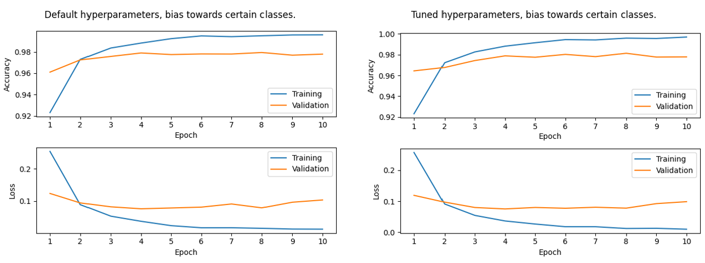

# Digit Classifier
Repository for a Machine Learning project

## Abstrct
This report focuses on the research question of "How can a model be trained
to accurately classify handwritten digits
with high accuracy?". In order to answer
this question, this report goes into details
about the usage of data analysis for pre-processing data evaluation, as well as several techniques for data preprocessing
and model construction. Data analysis
showed some unbalanced data entries for
different features, which is corrected by
undersampling the data to have a more
balanced data set going into the machine
learning model. In this paper, we present
the model with the most accurate results,
which was selected from a range of models. Additionaly, this paper outlines the
intricacies of Hyperband search that was
used to find the most optimal hyperparameters. In order to demonstrate the effi cacy of the model, we describe the findings of a performed evaluation based on
a number of metrics as well as providing a comparative analysis between it and
the baseline model. Through this comparison, it was possible to highlight the
improvements of the model in terms of
its performance and generalizability. The
results demonstrate that the approaches used to develop a model could produce fairly satisfactory outcomes.

##  Data Collection Comparison
 - Non-biased model vs Biased model  
    - By under-sampling, bias can be reduced
 - Default hyperparameters vs Tuned hyperparameters 
    - By setting different hyperparameters

- Biased model

    

- Non-biased

    

## Optimal hyperparameters
To get the best hyperparameters, we set the following conditions:
1. number of neurons in the 2nd hidden layer
2. rate of dropout layer to prevent overfitting
3. activation of the layer
4. learning rate (default 0.001)

we have found the most suitable
set of hyperparameters values (see figure below). These values have been used in the
improved version of our model. Further
comparisons to the baseline model will
be made taking these optimal values into
the account.

  

## Result from data

- Lower loss value with a non-biased model

    - Loss: 0.075 < 0.091

- Higher accuracy than one from a biased model

    - Accuracy: 0.9833 > 0.9775

## Research question
“How can a model be trained to accurately classify handwritten digits with high accuracy?”


## Datasets
Datasets are located in the `data` directory. Since GH is limited to the files of size 100MB, run the shell script in the root of the project to zip the datasets in their respective archives in the following way:
```
./archive_data.sh
```
or
```
sh archive_data.sh
```

## Evaluation
The model with these hyperparameters achieved excellent results on the test
dataset, having an accuracy of 98.50% on
the test data, with a training and validation losses of 9.21% and 12.34% respec-
tively, that indicated that the choice of
layers and parameters is appropriate for the research question.
The performance of the model could be improved by tuning its hyperparameters.
We compared the performance of our
model with the baseline model which
our model used to build on. Our
model with tuned hyperparameters outperformed the baseline model in every
metric. While our model achieved a
98.50% accuracy on the test set and
12.34% validation loss, baseline model
only scored 97.11% and 13.82% respectively. The improvement in performance could be attributed to optimizations made by tuning hyperparameters
and introducing additional layers, allowing the model to learn more complex patterns, while reducing the potential overfitting of data.
